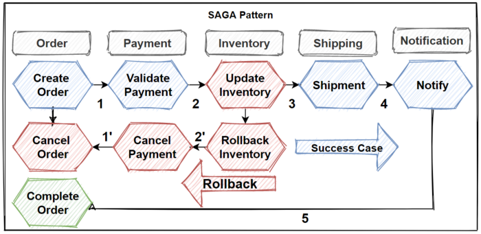

# Distributed transactions
When a microservice architecture decomposes a monolithic system into self-encapsulated services,
it can break transactions. This means a local transaction in the monolithic system is now 
distributed into multiple services that will be called in a sequence.

**Monolithic system:**  

In the customer order example above, if a user sends a Put Order action to a monolithic system,
the system will create a  local database transaction that works over multiple database tables. 
If any step fails, the transaction can roll back. This is known as **ACID (Atomicity, Consistency,
Isolation, Durability),** which is guaranteed by the database system.

**Microservices system:**  

When a Put Order request comes from the user, both microservices will be called to apply changes
into their own database. Because the transaction is now across multiple databases, it is now 
considered a **distributed transaction.**

## The problem (no ACID):

  - **How do we keep the transaction atomic?**  
  In a database system, atomicity means that in a transaction either all steps complete or no 
    steps complete. The microservice-based system does not have a global transaction coordinator
    by default. In the example above, if the CreateOrder method fails, how do we roll back the 
    changes we applied by the CustomerMicroservice?

  - **Do we isolate user actions for concurrent requests?**  
  If an object is written by a transaction and at the same time (before the transaction ends),
    it is read by another request, should the object return old data or updated data? In the 
    example above, once UpdateCustomerFund succeeds but is still waiting for a response from 
    CreateOrder, should requests for the current customer's fund return the updated amount or
    not?
    
## The solution:

### 1) <ins>Two-phase commit (2PC):</ins>
**As its name hints, 2pc has two phases:**  
  - **Prepare phase:**  
    In the prepare phase, all microservices will be asked to prepare for some data change that 
    could be done atomically. 
  - **Commit phase:**  
    Once all microservices are prepared, the commit phase will ask all the microservices to make the actual changes.

Normally, there needs to be a global coordinator to maintain the lifecycle of the transaction,
and the coordinator will need to call the microservices in the prepare and commit phases.

If at any point a single microservice fails to prepare, the Coordinator will abort the 
transaction and begin the **rollback process.**

**Pros:**
  -  First, the prepare and commit phases guarantee that the transaction is **atomic.** The
     transaction will end with either all microservices returning successfully or all 
     microservices have nothing changed.
  - Secondly, 2pc allows **read-write isolation.** This means the changes on a field are not 
    visible until the coordinator commits the changes.
     
**Cons:**
  - **Synchronous (blocking):**  
    While 2pc has solved the problem, it is not really recommended for many microservice-based
    systems because 2pc is synchronous (blocking). The protocol will need to lock the object 
    that will be changed before the transaction completes.   
    This is not good. In a database system, transactions tend to be fast—normally within 50 ms.
    However, microservices have long delays with RPC calls, especially when integrating with 
    external services such as a payment service. The lock could become a system performance 
    bottleneck. Also, it is possible to have two transactions mutually lock each other (deadlock) 
    when each transaction requests a lock on a resource the other requires.
    
    
### 2) <ins>SAGA pattern:</ins>  

The Saga pattern is another widely used pattern for distributed transactions. It is different 
from 2pc, which is synchronous. The Saga pattern is asynchronous and reactive. In a Saga pattern,
the distributed transaction is fulfilled by asynchronous local transactions on all related 
microservices. The microservices communicate with each other through an event bus.

**Rollback:**  
  

###  - **Choreography-based saga:**  
  
When using choreography, there’s no central coordinator telling the saga participants what to do. Instead,
the saga participants subscribe to each other’s events and respond accordingly.  
**An e-commerce application that uses this approach would create an order using a choreography-based saga 
that consists of the following steps:**
  1. The Order Service receives the POST /orders request and creates an Order in a PENDING state; 
  2. It then emits an Order Created event;
  3. The Customer Service’s event handler attempts to reserve credit;
  4. It then emits an event indicating the outcome;
  5. The OrderService’s event handler either approves or rejects the Order;

###  - **Orchestration-based saga (event bus):**  

**An e-commerce application that uses this approach would create an order using an orchestration-based saga
that consists of the following steps:**  
  1. The Order Service receives the POST /orders request and creates the Create Order saga orchestrator;
  2. The saga orchestrator creates an Order in the PENDING state;
  3. It then sends a Reserve Credit command to the Customer Service;
  4. The Customer Service attempts to reserve credit;
  5. It then sends back a reply message indicating the outcome;
  6. The saga orchestrator either approves or rejects the Order;
