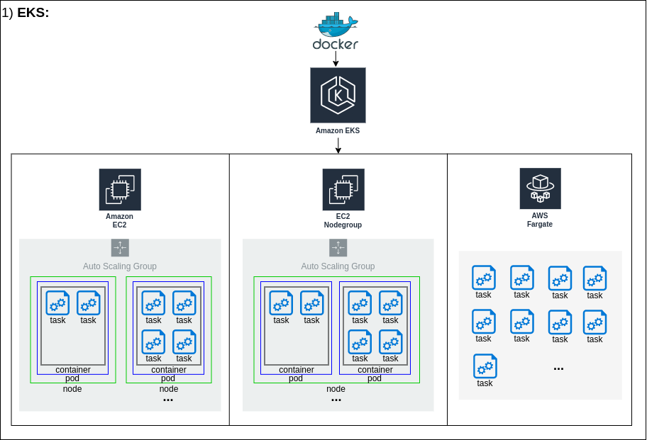
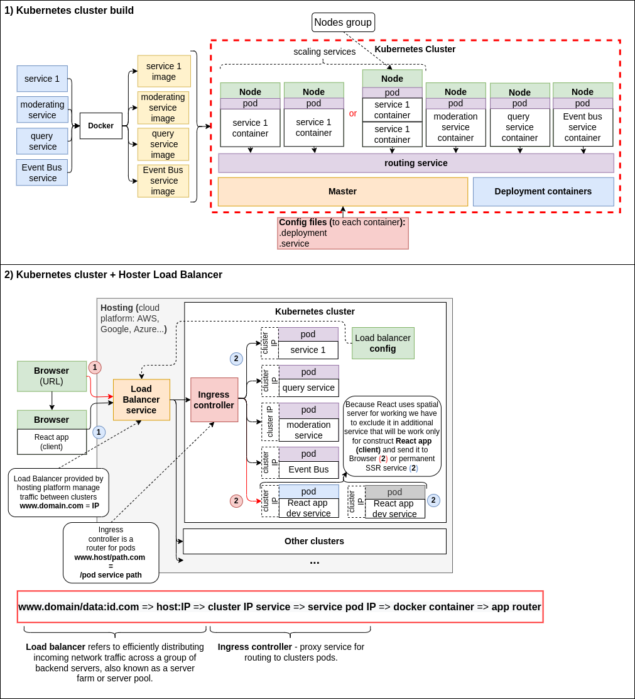

# Amazon Elastic Kubernetes Service (EKS) / Kubernetes

**Amazon Elastic Kubernetes Service (Amazon EKS)** is a managed container service to run and scale 
Kubernetes applications in the cloud or on-premises. You can migrate you kubernetes service to different 
cloud services one of them is a AWS EKS.

### Launch types:
  - **Fargate launch type;**  
    AWS manages even more of the server for you. You don't even have to think about instance types. 
    Just tell EKS how much RAM and CPU you need and that's it.
  - **EC2 Node launch type;**  
    You bring your own servers and have more control of the server. You have to manage it yourself
    though. So people also call this unmanaged.
  - **EC2 Nodes group launch type;**  
    AWS manages the servers for you. You just have to specify some configurations of server instance
    types.

## KUBERNETES
**Kubernetes** - platform for managing cluster of containers.  
**Cluster** - is a set of node machines (Linux virtual machines) for running containerized 
applications (services wrapped in Docker containers) with tools that helps managing them, that forms 
a network between services.    
**Node** - virtual machine foo running containers (Linux).  
**Pod** - it's a wrapper around a container for managing it by kubernetes.  
**Deployment** - service for managing containers through pods wrappers (build,restart if some crashed,
check consistence...).  
**Service** - service that makes network into cluster through which containers could communicate 
between themselves (Event Bus <=> Service 1 ...):  
  - Cluster IP - set up URL to access the pod inside the cluster;
  - Node Port - uses for accessing pod outside the cluster (dev purposes);
  - Load Balancer - uses for accessing pod outside the cluster (prod purposes);
  - External Name - redirection by URL name;
    

## EKS vs ECS

