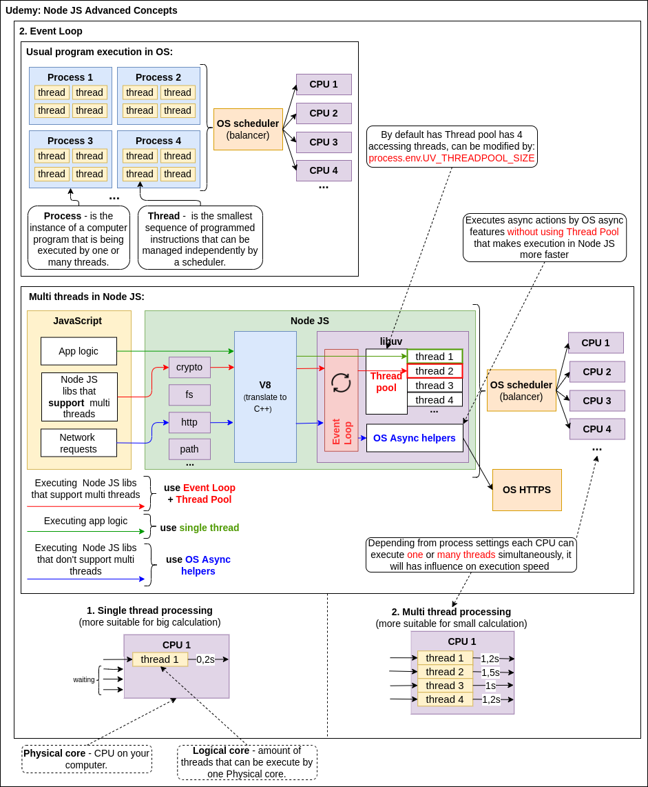

# Asynchronicity

## 1. Event Loop:

[](../../images/pasted%20image%200.png)

Differences between browser's event loop: is that in browser async processes is 
working with external APIs which computing going on servers or browsers separate 
threads, but in Node JS  async processes is working with Node js basic libs: http, streams, crypto, fs... wich computing going in separete threads.

### Фази Event Loop

[.png)](../../images/pasted%20image%200%20(1).png)

**В libuv є 7 фаз:**
  1. **<ins>Timers:</ins>**  
     На цій фазі запускається код, запланований за допомогою setTimeout() та 
     setInterval(). Це відбудеться якомога швидше після заданого проміжку часу, 
     однак операційна система або інші колбеки можуть його затримати. NodeJS тільки 
     гарантує, що він виконається не раніше заданого таймауту. Тобто запис 
     setTimeout(() => console.log('log'), 1000) означає, що колбек виконається після
     закінчення 1000 мілісекунд, це може бути 1004мс, 1100мс або навіть більше.  
     Ex: `setTimeout(), setInterval()`
  2. **<ins>Pending callback:</ins>**  
     На цій фазі виконуються I/O колбеки, відкладені з попередньої ітерації циклу. 
     Наприклад, помилки, колбеки яких не були виконані раніше через спроби системи 
     їх виправити. Так, помилки ECONNREFUSED повідомлення TCP сокету на деяких *nix 
     системах можуть будуть опрацьовані на цій фазі.
  3. **<ins>Idle + Prepare:</ins>**  
     В Node не використовуються. На цій фазі виконуються внутрішні операції libuv та
     підготовка до poll фази.
  4. **<ins>Poll:</ins>**  
     Фаза poll розраховує на скільки вона повинна заблокувати Event Loop і очікувати 
     події та, власне, опрацьовує ці події.
    
     Якщо Event Loop перейшов в poll фазу і немає коду, запланованого за допомогою 
     setImmediate(), то буде виконано її колбеки, поки вони не закінчаться або поки
     не досягнеться їх ліміт. Якщо черга пуста, Event Loop буде очікувати на нові 
     події і після цього одразу їх опрацює.
    
     Якщо Event Loop перейшов в poll фазу і її черга пуста, але раніше викликався 
     setImmediate(), то poll фаза буде пропущена і цикл одразу перейде до фази check.
  5. **<ins>Check:</ins>**  
     На цій фазі виконується код, запланований за допомогою setImmediate(). Це
     дозволяє виконати певний код одразу після poll фази. Коли фаза poll стає 
     неактивною і є код, поставлений в чергу за допомогою setImmediate(), Event Loop 
     перейде в check фазу, замість очікування нових I/O подій.  
     Ex: `setImmediate()`  
     Функція `setImmediate` дозволяє запланувати код, який виконається одразу після 
     фази poll на check фазі. Оскільки setImmediate() та setTimeout()/setInterval() 
     виконуються на різних фазах циклу, їх порядок залежить від контексту виконання. 
     Якщо обидві функції викликаються з головного модуля, їх порядок залежить від 
     продуктивності процесу, на який можуть впливати інші запущені процеси.
  6. **<ins>Close callbacks:</ins>**  
     Остання фаза, протягом якої виконуються закриваючі колбеки, наприклад, 
     socket.on('close'). Якщо обробник або сокет закрився неочікувано, на цій фазі
     буде виконано подію close, в іншому випадку вона буде запущена через 
     process.nextTick().
     Ex: `procces.nextTick()`  
     В NodeJS до версії 11, черга process.nextTick() опрацьовувалася між фазами
     Event Loop. Але зараз, у версії 11+, код, запланований за допомогою
     process.nextTick(), буде виконано між колбеками поточної черги фази циклу подій;

Дві фази не використовуються в NodeJS, а саме idle та prepare.

Кожна з фаз представляє собою **FIFO-чергу** колбеків, коли Event Loop переходить в 
конкретну фазу, він виконує операції пов’язані з нею та колбеки в черзі, поки вони 
не закінчаться або поки максимальна їх кількість не виконається, після цього він 
переходить до наступної фази.

### Microtask queue:
В NodeJS також є черга мікротасок, її колбеки запускаються одразу після колбеків 
process.nextTick(), саме в цю чергу і попадають колбеки промісів;

## 2. Multi-threads vs Single thread:  

[](../../images/event_loop.drawio.png)

## 3.Process flow: 
1) **Sync code;**
2) **Async code:**
     1. Event Loop Microtasks:
          1. process.nextTick();
          2. Promise;
     2. Event Loop Phases:
        1. timers
        2. pending callback
        3. poll (check ? check : poll)
        4. check
        5. close callbacks
     3. Event Loop Microtasks:
          1. process.nextTick();
          2. Promise;  
     
     4. ...

**Example:**  
```js
     const fs = require('fs');
     
     fs.readFile(__filename, () => {  // 2. Event Loop Phases (4. check ? 4. check : 3. poll) // second EL iteration start
       console.log('readFile'); // 2.1 Event Loop Phases (3. poll)
     
       setTimeout(() => console.log('timeout1')); // 3. Event Loop Phases (1. timeout) // third EL iteration start
       setImmediate(() => console.log('immediate1')); // 2.4 Event Loop Phases (4. check) // second EL iteration end
       Promise.resolve()
         .then(() => console.log('Promise.resolve1')); // 2.3 Event Loop Microtasks
       process.nextTick(() => console.log('process.nextTick1')); // 2.2 Event Loop Microtasks
     });
     
     setTimeout(() => console.log('timeout2')); // 1.4 Event Loop Phases (1. timeouts)
     setImmediate(() => console.log('immediate2')); // 1.5 Event Loop Phases (4. check ? 4. check : 3. poll) // first EL iteration end
     Promise.resolve()
       .then(() => console.log('Promise.resolve2')); // 1.3 Event Loop Microtasks
     process.nextTick(() => console.log('process.nextTick2')); // 1.2 Event Loop Microtasks
     
     console.log('sync code'); // 1.1 Sync code
```


