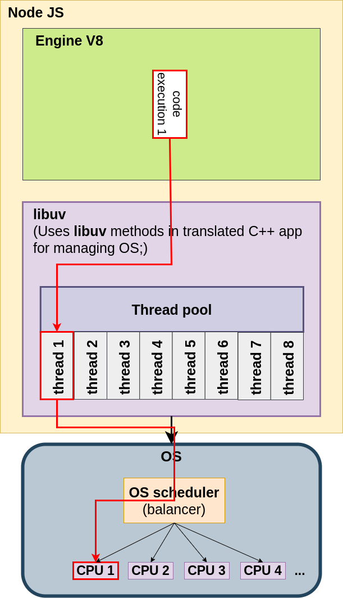

# Thread Pool

The libuv library maintains a pool of threads that are used by node.js to perform 
long-running operations in the background, without blocking its main thread.

Node uses the Worker Pool to handle “expensive” tasks. This includes I/O for which an 
operating system does not provide a non-blocking version, as well as particularly 
CPU-intensive tasks.

