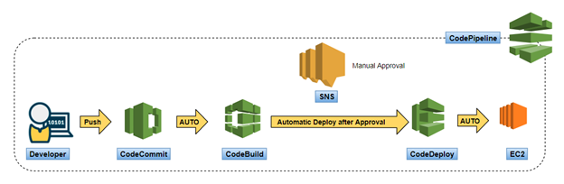

# CI / CD

**Continuous Integration (CI)** is the process of automating the build and testing of code every 
time a team member commits changes to version control. 

**Responsibilities:**
  - Push the code to the storage;
  - Build the service;
  - Test the service;
  - Get notification if passed / failed;

**Continuous Deployment (CD)** can be thought of as an extension of continuous integration, and is 
the process of automatically deploying an application after CI is successful.

**Responsibilities:**
  - Deploy;
  - Versioning;

