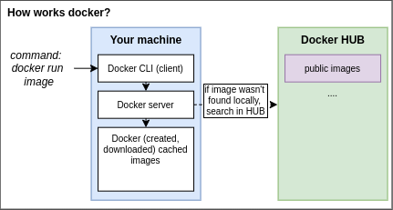
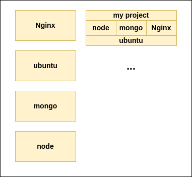
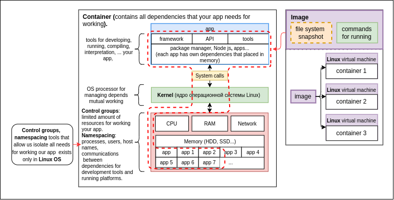

# DOCKER

**<ins>Docker</ins>** - is an ecosystem or a platform for creating and running containers on Linux
virtual machine that consists: CLI, server, machine, images, Hub, compose.

### Docker architecture:

Docker uses a client-server architecture. The Docker client talks to the Docker daemon, which does
the heavy lifting of building, running, and distributing your Docker containers. The Docker client
and daemon can run on the same system, or you can connect a Docker client to a remote Docker daemon.
The Docker client and daemon communicate using a REST API, over UNIX sockets or a network interface. 
Another Docker client is Docker Compose, that lets you work with applications consisting of a set 
of containers.

[](../../images/architecture.svg)

### 1) **<ins>The Docker client</ins>**  
   The Docker client (docker) is the primary way that many Docker users interact with Docker. When
   you use commands such as docker run, the client sends these commands to dockerd, which carries
   them out. The docker command uses the Docker API. The Docker client can communicate with more
   than one daemon.

### 2) **<ins>The Docker daemon</ins>**  
   The Docker daemon (dockerd) listens for Docker API requests and manages Docker objects such as 
   images, containers, networks, and volumes. A daemon can also communicate with other daemons to
   manage Docker services.

### 3) **<ins>Docker registries</ins>**  
   A Docker registry stores Docker images. Docker Hub is a public registry that anyone can use, 
   and Docker is configured to look for images on Docker Hub by default. You can even run your
   own private registry.  
   --  
   When you use the docker pull or docker run commands, the required images are pulled from your 
   configured registry. When you use the docker push command, your image is pushed to your
   configured registry.  
   
   [](../../images/docker_run.drawio.png)
  ```text
  # Скачиваем образ на локальный компьютер                                                                                       
  docker pull nginx
  
  # Задаём новое имя образу                                                                                                      
  docker image tag nginx sotream/nginx
  
  # Пушим образ в пользовательский репозиторий                                                                                   
  docker push sotream/nginx
  ```

### 4) **<ins>Docker store / hub</ins>**
  **Docker hub** — облачное хранилище предназначенное для создания
  публичных и приватных репозиториев для образов. Репозиторий для работы
  с Docker по умолчанию. Альтернативы: AWS ECR, Nexus.

  **Docker Store** — магазин, где можно приобрести или купить подписку на официальные,
  сертифицированные образы

### 5) **<ins>The Docker Images</ins>**  
   An image is a read-only template with instructions for creating a Docker container. Often, an 
   image is based on another image, with some additional customization. For example, you may build
   an image which is based on the ubuntu image, but installs the Apache web server and your 
   application, as well as the configuration details needed to make your application run.  
   --  
   You might create your own images or you might only use those created by others and published in a
   registry. To build your own image, you create a Dockerfile with a simple syntax for defining the
   steps needed to create the image and run it. Each instruction in a Dockerfile creates a layer in
   the image. When you change the Dockerfile and rebuild the image, only those layers which have 
   changed are rebuilt. This is part of what makes images so lightweight, small, and fast, when 
   compared to other virtualization technologies.

   [](../../images/docker_images.drawio.png)

### Console commands: 
   - **IMAGES INFO:**
      ```text
         docker images
         docker image ls
         docker image ls <repository name/tag>
      ```
   - **IMAGE HISTORY:**
      ```text
         docker image history <repository name/tag>
      ```
   - **COPY AND RENAME THE IMAGE:**
     ```text
        docker image tag <repository name/tag> <new repository name/tag>
     ```
   - **INSPECT IMAGE**
     ```text
        docker image inspect <repository name>
     ```
     - **Directives:**
       - `--format`:  
         Format output image info:
         ```text
           docker image inspect <repository name> --format "{{.Config.Env}}"
         ```
   - **PULL IMAGE FROM DOCKER HUB:**
      ```text
         docker pull <repository name>
         docker pull <repository name:version>
         docker pull -a <repository name> // pull all versions
         docker image pull <repository name/tag>  // pull users image
      ```
   - **ADD NEW IMAGE:**
     1) Create container base on the basic image;
     2) Run and add new dependencies;
     3) Create new image from this container;
      ```text
        docker container commit --author <author PID> --message <commit message> <CONTAINER_ID> <new image name (REPOSITORY): tag>
     
        // Example: 
     
        // 1) create a simple container by basic image (ubuntu): 
        docker container run -i -t --name proxy ubuntu
      
        // 2) add addition layers to the container inside it:
        apt-get update
        apt install sudo
        sudo apt install curl
        curl -sL https://deb.nodesource.com/setup_14.x | sudo -E bash -
        sudo apt install nodejs
     
        // 3) check the container ID and create a new image:
        docker container ls
        docker container commit --author "Mikhail Rudev" --message "Add curl, sudo, node, npm" 2fdf50a2201e env:node-npm
      ```
   - **PUSH IMAGE**
     ```text
        docker image push <repository name/tag>
     ```
   - **REMOVE ALL UNUSED IMAGES:**
     ```text
        docker system prune -a -f
     ```
   - **REMOVE IMAGE:**
      ```text
         docker image rm <options> <repository name/tag>
      ```
### 6) **<ins>The Docker Containers</ins>**  
   A container is a runnable instance of an image. You can create, start, stop, move, or delete
   a container using the Docker API or CLI. You can connect a container to one or more networks, 
   attach storage to it, or even create a new image based on its current state.  
   --  
   By default, a container is relatively well isolated from other containers and its host machine.
   You can control how isolated a container’s network, storage, or other underlying subsystems are
   from other containers or from the host machine.  
   --  
   A container is defined by its image as well as any configuration options you provide to it when
   you create or start it. When a container is removed, any changes to its state that are not 
   stored in persistent storage disappear.
   
   [](../../images/docker_container.drawio.png)

### Docker Container VS Virtual Machine:
  **<ins>Virtualization</ins>** is the process in which a system singular resource like RAM, CPU,
  Disk, or Networking can be ‘virtualized’ and represented as multiple resources.
  
  **<ins>Containers</ins>** are lightweight software packages that contain all the dependencies required to execute 
  the contained software application. These dependencies include things like system libraries, 
  external third-party code packages, and other operating system level applications. The dependencies
  included in a container exist in stack levels that are higher than the operating system.
  
  **<ins>Virtual machines</ins>** are heavy software packages that provide complete emulation of low level hardware 
  devices like CPU, Disk and Networking devices. Virtual machines may also include a complementary 
  software stack to run on the emulated hardware. These hardware and software packages combined 
  produce a fully functional snapshot of a computational system.
  
  [](../../images/Screen-Shot-2018-03-20-at-9.24.09-AM_tcm19-56643.avif)
  
  `The key differentiator between containers and virtual machines is that virtual machines virtualize 
  an entire machine down to the hardware layers and containers only virtualize software layers above
  the operating system level.`

### Console commands:
- **CREATE CONTAINER:**  
  ```text
  docker create <options> <image name:tag>
  docker container create <options> <image name:tag>
  ```
  - **CONTAINERS INFO:**
     ```text
       docker ps <options>
       docker container ls <options>
     ```
    - **Directives:**
      - `-a` or `-all`:  
        By default the command shows just running. Adding the `-a` directives shows all containers (running, stopped):
        ```text
          docker container ls -a
        ```
  - **RUN CONTAINER:**
     ```text
       docker run <image name:tag> // by default run on 80 container port can't interact with outer services
       docker container run <image name:tag>
    
       // Example: 
       docker container run nginx
     ```
    - **Types of running:**
      - <ins>default</ins> or `-i` or `--interactive`:  
        This means we can't return to our shell prompt until the process finishes.
         ```text
            docker container run -p 80:80 nginx
         ```
      - <ins>detached mode</ins> `-d`:    
        This command starts the container, prints its id, and then returns to the shell prompt. Thus, we can continue
        with other tasks while the container continues to run in the background.
        ```text
           docker container run -d -p 80:80 nginx
        ```

    - **Directives:**
      - `-p` or `-published`:  
        Set the interaction from outside the container by defining the directive: `-p or -published`
        ```text
          docker container run -p 80:80 <image name>
        ```
      - `--name`, `--pid`:  
        Run the container by its name or ID:
        ```text
          docker container run --name <container name> <image name>
          docker container run --pid <container id> <image name>
        
           // Example: 
           docker container run --name webhost nginx
        ```
      - `--health-cmd`, `--health-retries`, `--health-interval`:  
        Set health check config that will be run before start:
        ```text
          ... --health-cmd <outer path> --health-retries <number of retries> --health-interval <time interval> <image name>
        
          // Example: 
          docker container run -d -p 80:80 --name proxy --health-cmd 'curl http://localhost:80/' --health-retries 3 --health-interval '1s' nginx
        ```  
      - `--memory` or `-m`:  
        Set the hard memory limit.
        Limit in bytes. 10485760 = 10Mb (10 * 1024 * 1024):
        ```text
          ... -m <hard memory amount> <image name>
        
          // Example: 
          docker container run -d -p 80:80 --name proxy -m 10485760 nginx
        ```  
      - `--memory-reservation`:  
        Set the RAM limit:
        ```text
          ... --memory-reservation <RAM amount> <image name>
        
          // Example: 
          docker container run -d -p 80:80 --name proxy --memory-reservation 5242880 nginx
        ``` 
      - `--memory-swap`:  
        Set the SWAP memory limit:
        ```text
          ... --memory-swap <swap memory amount> <image name>
        
          // Example: 
          docker container run -d -p 80:80 --name proxy --memory-swap 10485760 nginx
        ``` 
      - `--restart`:  
        Set restart policy:
        - no — default
        - on-failure — перезагрузить в случае ошибки
        - always — всегда перезагружать
        - unless-stopped — пока контейнер не будет остановлен
        ```text
          ... --restart <option> <image name>
        
          // Example: 
          docker container run -d -p 80:80 --name proxy --restart always nginx
        ``` 
      - `--rm`:  
        Set the policy of removing the container after stopping it:
        ```text
          docker container run --rm ...
        
          // Example: 
          docker container run --rm -d -p 80:80 --name proxy nginx
        ``` 
      - `-it` or `-i -t`:  
        Open the terminal inside the container:
        ```text
          docker container run -it --name proxy ubuntu bash
        
          // Example: 
          docker container run -i -t --name proxy ubuntu bash
        ``` 
  - **EXECUTE COMMANDS IN RUNNING CONTAINER:**
     ```text
       docker container exec -it <container name> <command line tool>
    
       // Example: 
       docker container exec -it proxy bash
     ``` 
  - **COPY FILES INSIDE THE CONTAINER:**
    ```text
      docker container cp <path to local files> <container name: path where copy files>

      // Example: 
      docker container cp ./data/* proxy:/usr/project
    ```
  - **CHECK THE DIFFERENCES AFTER CHANGING THE CONTAINER:**
    ```text
      docker container diff <container name>

      // Example: 
      docker container cp ./data/* proxy:/usr/project
      docker container diff proxy
    ```   
  - **REMOVE CONTAINER / REMOVE ALL CONTAINERS:**
     ```text
         // 1) remove container
         docker rm <options> <container name> or <hash>
         docker container rm <options> <container name> or <hash>
    
         // 2) remove all stopped containers
         docker container prune

         // Example: 
         docker container rm webhost
     ```
    - **Directives:**
      - `-f` or `--force`:  
        Force remove;
          ```text
            // Example: 
            docker container rm -f webhost
         ```
  - **RESTART THE CONTAINER:**
     ```text
       docker container restart <container name>
    
       // Example: 
       sleep 5
       docker container restart proxy
     ```
  - **STOP / START CONTAINER:**
     ```text
      docker stop <container name> or <hash>
      docker container stop <container name> or <hash>
    
      docker start <container name> or <hash>
      docker container start <container name> or <hash>
    
       // Example: 
       docker container stop webhost
       docker container start webhost
     ```
  - **PAUSE / UNPAUSE CONTAINER:**
    ```text
       docker pause <container name> or <hash>
       docker container pause <container name> or <hash>
    
       docker unpause <container name> or <hash>
       docker container unpause <container name> or <hash>

       // Example: 
       docker container pause webhost
       docker container unpause webhost
     ```
  - **INSPECT CONTAINER:**
    ```text
       docker inspect <container name> or <hash>
       docker container inspect <container name> or <hash>
       
       // Example:
       docker container inspect webhost
    ```
    - **Directives:**
      - `--format`:  
        Get the info in certain format:
        ```text
          docker container inspect proxy --format "IP: {{ .NetworkSettings.IPAddress }} | Gateway: {{.NetworkSettings.Networks.bridge.Gateway}}"
        ```
  - **CONTAINER PROCESSES:**
    ```text
      docker top <container name> or <hash>
      docker container top <container name> or <hash>
    
      // Example:
      docker container top webhost
    ```
  - **CONTAINERS STATS:**
    ```text
      docker stats
      docker container stats
    ```
  - **CONTAINER ATTACH:**  
    See logs of already running (in background `-d`) container from console:
    ```text
      docker container attach proxy <container name>
    
      // Example:
      docker container run -d -p 80:80 --name proxy nginx
      docker container attach proxy 
    ```
  - **CONTAINER RENAME:**
    ```text
      docker container rename <old name> <new name>
    
      // Example:
      docker container rename proxy1 proxy
    ```


