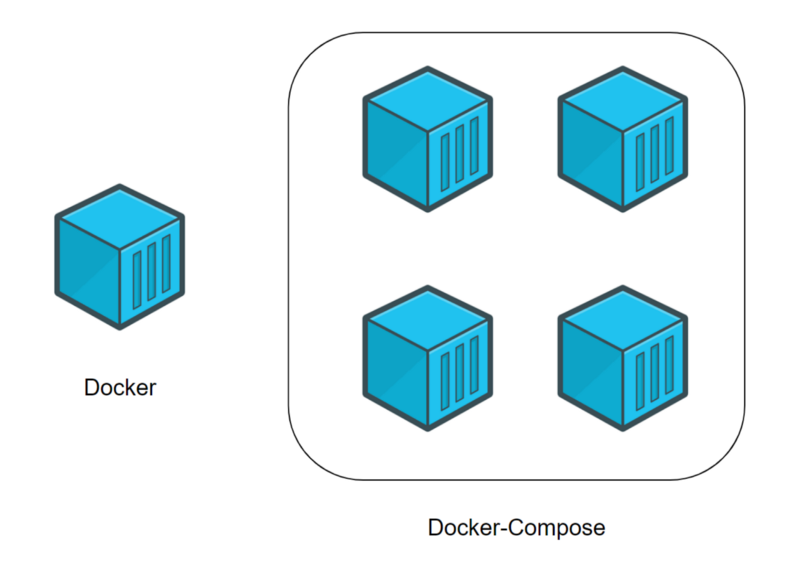

# The Docker Compose

**Docker Compose** используется для одновременного управления несколькими контейнерами, входящими
в состав приложения. Этот инструмент предлагает те же возможности, что и Docker, но позволяет
работать с более сложными приложениями.

