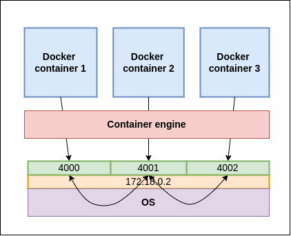
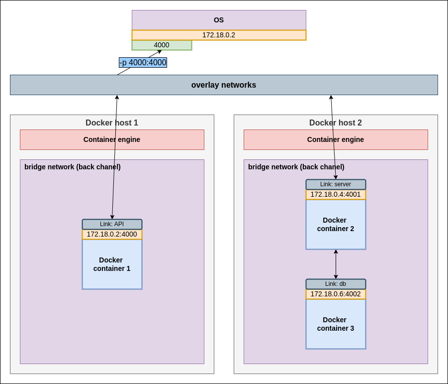

# The Docker Networks

One of the reasons Docker containers and services are so powerful is that you can connect them
together, or connect them to non-Docker workloads. Docker containers and services do not even
need to be aware that they are deployed on Docker, or whether their peers are also Docker workloads
or not. Whether your Docker hosts run Linux, Windows, or a mix of the two, you can use Docker to
manage them in a platform-agnostic way.

## Network drivers
Docker’s networking subsystem is pluggable, using drivers. Several drivers exist by default, and
provide core networking functionality:
- **bridge (default):**   
  The default network driver. If you don’t specify a driver, this is the type of network you are
  creating. Bridge networks are usually used when your applications run in standalone containers
  that need to communicate. See bridge networks.
- **host:**  
  For standalone containers, remove network isolation between the container and the Docker host,
  and use the host’s networking directly. See use the host network.
- **overlay:**  
  Overlay networks connect multiple Docker daemons together and enable swarm services to
  communicate with each other. You can also use overlay networks to facilitate communication
  between a swarm service and a standalone container, or between two standalone containers on
  different Docker daemons. This strategy removes the need to do OS-level routing between these
  containers. See overlay networks.
- **ipvlan:**  
  IPvlan networks give users total control over both IPv4 and IPv6 addressing. The VLAN driver
  builds on top of that in giving operators complete control of layer 2 VLAN tagging and even
  IPvlan L3 routing for users interested in underlay network integration. See IPvlan networks.
- **macvlan:**  
  Macvlan networks allow you to assign a MAC address to a container, making it appear as a
  physical device on your network. The Docker daemon routes traffic to containers by their
  MAC addresses. Using the macvlan driver is sometimes the best choice when dealing with legacy
  applications that expect to be directly connected to the physical network, rather than routed
  through the Docker host’s network stack. See Macvlan networks.
- **none:**  
  For this container, disable all networking. Usually used in conjunction with a custom network
  driver. none is not available for swarm services. See disable container networking.

### Console commands:
  - **CREATE NETWORK:**
    ```text
      docker network create <network name>
    ```
  - **REMOVE NETWORK:**
    ```text
      docker network rm <network name>
    ```
  - **REMOVE UNUSED NETWORKS:**
    ```text
      docker network prune
    ```
  - **NETWORKS INFO:**
    ```text
      docker network ls
    ```
  - **NETWORK INFO:**
    ```text
      docker container inspect <network name> --format "{{ .NetworkSettings.Networks }}" # two networks 
    ```
  - **CONNECT / DISCONNECT NETWORK TO THE CONTAINER:**
    ```text
      docker network connect <network name> <container name>
      docker network disconnect <network name> <container name>
    ```
    
### Network net:
  1) **Bridge net** (default):  
     Without setting up network directly the container will be assigned to the `bridge` network;
     Driver `bridge` will assign own IPs to the container;
        - **separate docker files;**  
          To reach the other container you need to find out IP of running containers (`docker container
          inspect <id>`);
          
          [](../../images/docker_networks.drawio.png)
          
        - **docker compose;**    
          You can reach the other containers by it's name (link);  
          
          [](../../images/docker_networks3.drawio.png)
          
  2) **Host net:**  
     Container doesn't have own IP addresses and assign each container to the OS IPs;  
     
     [](../../images/docker_networks2.drawio.png)

  3) **Overlay net:**  
      Connect two separate docker networks;  
     
     [](../../images/docker_networks4.drawio.png)
