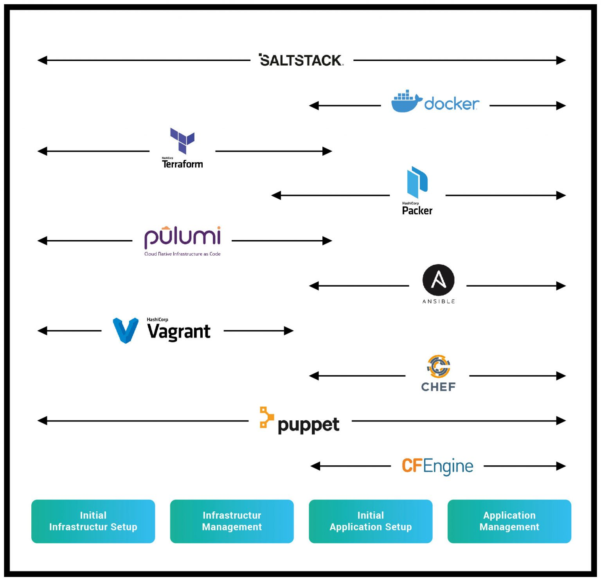

# Infrastructure as code (IaC)
  ### 1) **Initial Infrastructure Setup Phase:**
   - Provisioning of the infrastructure
   - Configuration of the infrastructure
  ### 2) **Maintaining Infrastructure Phase:**
  - Adjusting the infrastructure
  - Removal and addition of components
  ### 3) **Initial Software setup Phase:**
  - Initial installation of software
  - Initial configuration of software
  ### 4) **Maintaining Software Phase:**
  - Software Updates
  - Reconfiguration of software

## The different types of IaC:
  - **<ins>Scripts:</ins>**  
    The most basic way to automate something is to write a script. In doing so, the steps of the otherwise 
    manually performed task are written in the preferred script language and then executed in the target 
    environment.  
    **Popular scripting languages:**  
      - Bash;
      - Python;
      - Ruby;
      - Powershell;
  - **<ins>Configuration Management Tools</ins>**  
    Configuration management tools are designed to install and manage software on existing servers.  
    **Popular configuration management tools:**
      - CFEngine;
      - Ansible;
      - Chef;
      - Puppet;
      - Saltstack;
  - **<ins>Templating Tools</ins>**  
    An alternative to configuration management tools are templating tools, such as Docker, Packer and 
    Vagrant. Rather than launching a series of instances and configuring them by running the same code
    on each one, the idea behind templating tools is to create an image. This “snapshot” of the operating
    system, software and any files can thus be delivered as a standalone artefact in the form of an image.  
    **Popular Templating Tools:**
      - Docker; 
      - Packer;
      - Vagrant;
  - **<ins>Orchestration Tools</ins>**  
    Templating tools are great for creating VMs and containers, but how can you manage many of them 
    efficiently? This is where tools like Kubernetes, Amazon ECS, Docker Swarm or Nomad come into play.
    Since these tools are very complex and provide an enormous range of functionality, we will not go 
    into more detail about how they work here. The behaviour of a Kubernetes cluster can be defined by
    code. This includes, for example, how your Docker containers should be executed, how many instances
    should be kept running and how to proceed with a rollout.  
    **Popular Orchestration Tools:**  
      - Kubernetes;
      - Amazon ECS;
      - Docker Swarm;
      - Nomad;
  - **<ins>Provisioning Tools</ins>**  
    Provisioning tools like Terraform, AWS CloudFormation and Pulumi are mainly meant for describing and
    creating cloud infrastructure. In fact, you can use them to create not only servers, but also caches, 
    load balancers, firewall settings, routing rules and pretty much any other aspect of an IT infrastructure.
    Often configuration management or templating tools and provisioning tools intertwine. For example, 
    Terraform can create a VM that is then set up with Puppet.  
    **Popular Provisioning Tools:**  
      - Terraform;
      - AWS CloudFormation;
      - Pulumi;
